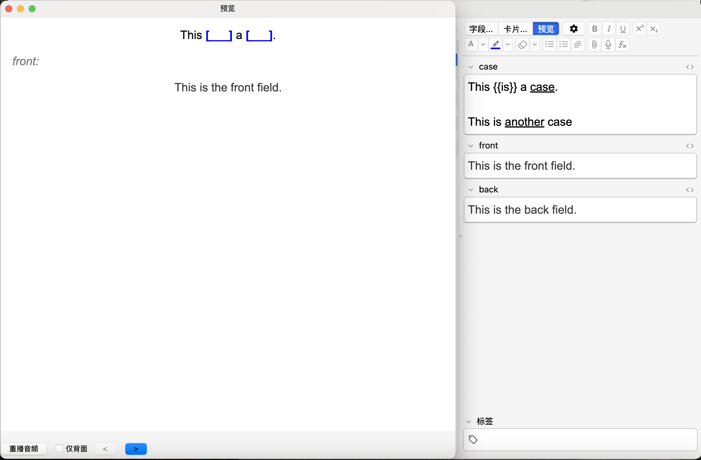
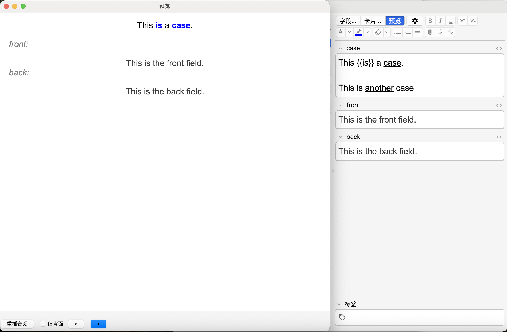

# Anki_CaseCard
一个支持在单张卡片中录入多个“案例问题”并在复习时随机呈现的Anki模版，旨在实现对当今间隔重复系统的拓展。

## 添加方式
打开Anki，新建模版，编辑为三个字段：
1. case
2. front
3. back

进入卡片模版编辑页面，将'CaseCard_Front.html'中的内容复制到“正面内容模版”，将'CaseCard_Back.html'中的内容复制到“背面内容模版”，将'style.css'中的内容复制到“样式”

或者使用release中的apkg包。

## 使用方法
在case字段中添加“案例问题”，将不同的问题以两个回车隔开（即中间空一行）。

通过使用下划线或{{ ... }}挖空，支持挖多个空及混用，但是不支持嵌套。

{{ ... }}中可以包含公式或图片。（每次复习时，会随机一个呈现case。）

front字段的内容每次都会在正面呈现，front字段和back字段的内容每次都会在卡背面呈现，back字段可用来填写实例其对应的源概念。

示例：

## 限制/bug
如果包含带格式复制粘贴的内容，可能会由于没有包含\<br\>\<br\>而导致中间显示一个空行，但无法识别为不同的“案例问题”

不能同时在一个“案例问题”的最后和另一个“案例问题”的最前面同时使用下划线挖空，否则会导致分割“案例问题”时割开了\<u\>和\</u\>标签而无法正常挖空

## 背景/设计思想介绍
人类的生理特点导致了我们在意识层面不能直接掌控对记忆的取舍，但是经过研究，人们已经找到了记忆的规律，间隔重复（SR）本身是对这种规律的应用：有间隔的提取练习可以促进记忆的长期保留。而SR本身，就是为了高效的实现“记住意识层面想要记住的知识”的这一目的。

从另一个层面说，使用间隔重复系统（SRS）的目的是为了确保在需要的情境下能够有效提取记忆。而很多知识需要能够在不同的场景下被提取以进行应用。
例如，英语单词单独拿出来没有太大的意义，背单词是为了在句子中能够快速识别，并理解其含义，从而达到理解句意的作用；
对于高考生，背的化学生物知识点通常并不总会原样考察，大多数都是在解题中间接、隐式的使用；
甚至还有Math Academy这类将SR应用到非单纯记忆类知识领域的系统，在这种情况下，每次提取练习必须在不同的情境下进行，因为识别不同的情境同样是需要学得的内容的一部分。
尤其是在[结构不良领域](https://zhuanlan.zhihu.com/p/1926281936806061883)，每一个具体问题都是一系列知识（概念）的结合体的实例化体现，因此，对于很多知识，单独制作简单的概念卡是不够的，加入具体的实例（情境）是必要的。

当下，几乎所有的SRS都以固定内容的卡片为单元安排复习。

与之对应的，传统制卡逻辑：在应用SRS时，我们往往会围绕一个需要记忆的点制作多张卡片，其中就包括为了每个知识的实例制作多张卡片的情况，并且调度算法会确保我们对每张卡片的记忆保留概率大于预设值。（知识点：实例卡1 - 调度1；实例卡2 - 调度2 ……）（当然，还有一种可能：放弃在SR中加入实例）

这并非最优的实现方式。

调度算法会确保我们对每张卡片的记忆保留概率大于预设值，然而，我们并非希望记住每一张卡片本身，只是希望记住需要的知识，并且在需要的场景能够成功识别并调用。这样一个知识对应多个卡片，在复习不同卡片时反而会产生干扰。

我们可以引入一个新机制，让SR调度单元与固定的卡片内容解耦，而将其关联到一个知识点上。对于这一个知识点，可以设置多个“卡片”，即促进主动提取的“问 - 答”，为了避免混淆，下面我称之为“案例问题”，每次复习调度到这个卡片时，随机抽取一个“案例问题”呈现。（知识点 - 调度：实例1；实例2……）

这样带来了两个好处，
1. 卡片归并
- 总体复习数量减少了，而需要记忆的内容本身仍被算法保证有效保留。减轻了复习负担。
- 单个问题被更少的重复，这进一步减小了对每个问题本身的记忆，让每一次提取练习能有更强的陌生感，从而确保能完成对知识本身的有效提取。
- 一个知识点只对应一个SR调度单元，算法能够更少干扰的预测这个知识点的记忆状态，从而提供更准确的调度。
2. 提取泛化
- 同一个知识在更少的复习下，相对更陌生的情况下，在不同的场景下完成提取，有利于增强泛化能力。
- 新机制的实现解决了上述问题，从而鼓励更多实例在SR中的加入。

而且即使添加的“案例问题”并非狭义的“类 - 实例”式“情境”问题的，从不同的角度激活记忆本身也具有上述价值。

这还可以提供一些新的制卡思路，例如，对于学习中的错题，我们没有必要以错题本身进行间隔重复，而是可以将错题添加为相应知识点的“案例问题”。

一些产品已经应用了这一思想。如在前所述的Math Academy中，间隔重复时。每次的复习内容是依据应用相应知识点的新题目，而非知识点本身或是做错过的原题；墨墨背单词中可以自选设置例句，每次复习会随机选取三个例句展示。

## 实现逻辑
这个模版尝试以一个轻量化的解决方案实现这一设想。

在Anki的非cloze类型模版中，一个note对应一个调度单元；且Anki使用WebView渲染卡片，因此也提供[不带担保的javascript功能](https://docs.ankiweb.net/templates/styling.html#javascript)。

将一个note对应一个知识点，在case字段里放置这个知识点对应的所有“案例问题”，每次加载卡片的时候，js代码会加载并随机选取一个问题呈现。

通过使用[anki-persistence](https://github.com/SimonLammer/anki-persistence)项目，我们可以将卡片正面选中的问题保存到背面提取，由此完成“问 - 答”展示。

这样的实现比插件更简单，容易自己定制，且理论上跨平台性能更好（但是只在macos上的25.02.5版上进行了测试）。

## 改进方法
可参考[官方文档的](https://addon-docs.ankiweb.net/debugging.html#webviews)，我选择使用[AnkiWebView Inspector](https://ankiweb.net/shared/info/31746032)插件。

Anki卡片模版编辑页面中没有高亮，可以填写相应字段后，打开卡片模版编辑页面，在inspector中把在正面和背面模版复制出来，整合到一个html页面中在代码编辑器里修改，在本地浏览器中打开调试，参考'dev_CaseCard.html'。

建议添加模版后新建一个示例笔记再修改，这样可以观察Anki如何将field中的内容转化为卡片中对应的dom元素。

## 许可证
以MIT License发布